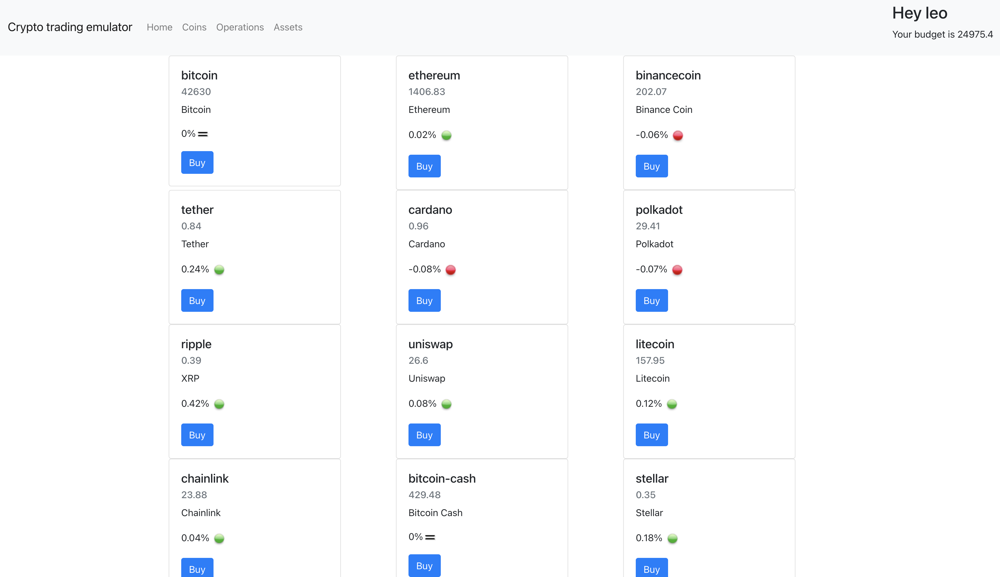

#Crypto trading emulator!

A simple kotlin/react platform to play in-memory and perform some basic crypto purchase/sell operations.

Crypto prices are being fetched from [Coingecko API](<https://www.coingecko.com/en/api>)

